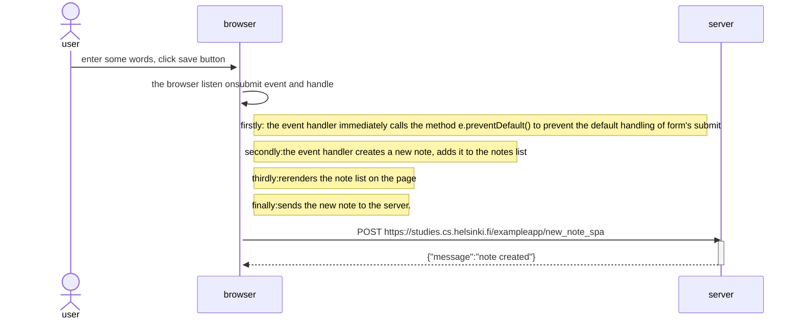

```mermaid
sequenceDiagram
    actor user
    participant browser
    participant server

    user->>+browser: enter some words, click save button
    browser->>browser: the browser listen onsubmit event and handle
    note right of browser: firstly: the event handler immediately calls the method e.preventDefault() to prevent the default handling of form's submit
    note right of browser: secondly:the event handler creates a new note, adds it to the notes list
    note right of browser: thirdly:rerenders the note list on the page
    note right of browser: finally:sends the new note to the server.

    browser->>server: POST https://studies.cs.helsinki.fi/exampleapp/new_note_spa
    activate server
    server-->>browser: {"message":"note created"}
    deactivate server

```